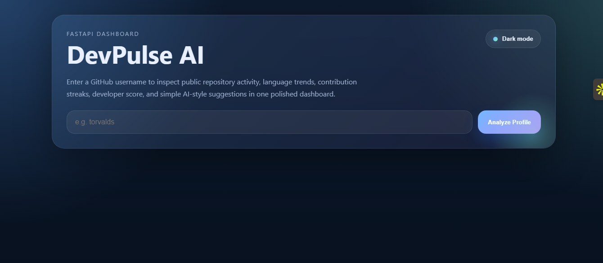
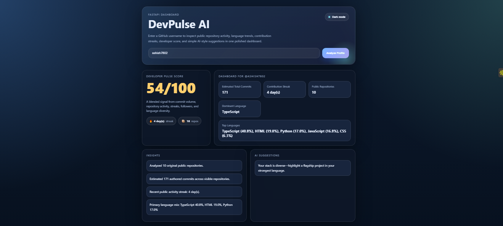

# 🚀 DevPulse AI

> 🔥 Analyze your GitHub like a pro — get insights, streaks & AI-powered suggestions instantly.

---

## 🌐 Live Demo

👉 **Try it now:** https://devpulse-ai-r0d4.onrender.com
⚡ *First load may take a few seconds (free hosting)*

---

## 🖼️ Preview

### 🔹 Home Screen



### 🔹 Dashboard Result



---

## ⭐ Why DevPulse AI?

DevPulse AI transforms your GitHub profile into meaningful insights:

* 📊 Developer Score (0–100)
* 🔥 Contribution Streak Tracking
* 🧠 Smart AI-style Suggestions
* 💻 Clean & Modern Dashboard

---

## ✨ Features

* 🔍 Analyze any GitHub profile instantly
* 📊 Developer productivity score
* 🔥 Contribution streak insights
* 🧠 Actionable improvement tips
* 🌙 Dark mode support
* ⚡ FastAPI powered backend

---

## 🧠 How It Works

1. Enter a GitHub username
2. DevPulse fetches public data via GitHub API
3. Analyzes repos, commits, and languages
4. Generates score + suggestions
5. Displays everything in a clean dashboard

---

## ⚙️ Installation

```bash
git clone https://github.com/YOUR_USERNAME/devpulse-ai.git
cd devpulse-ai

python -m venv .venv
source .venv/bin/activate  # Windows: .venv\Scripts\activate

pip install -r requirements.txt
```

---

## 🚀 Run Locally

```bash
uvicorn main:app --reload
```

👉 Open: http://127.0.0.1:8000

---

## 🔐 Optional Setup

```bash
export GITHUB_TOKEN=your_token_here
```

---

## 🚀 Roadmap

* [ ] Shareable profile links 🔗
* [ ] Leaderboard system 🏆
* [ ] Export report (PDF) 📄
* [ ] Advanced AI insights 🤖

---

## 🤝 Contributing

Pull requests are welcome!

---

## ⭐ Support

If you like this project:

👉 Drop a ⭐
👉 Share with friends

---

> 💬 Built with ❤️ for developers
